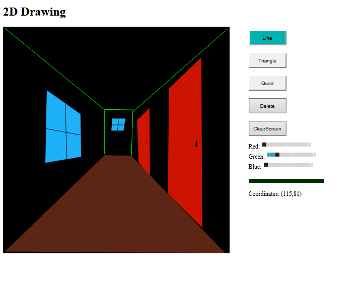

Simple drawing exercise built for ITCS 3120
Program allows the user to draw lines, triangles, and quads.
Previously drawn objects may be selected with right click.
Selected objects can have their color changed, or be deleted.

